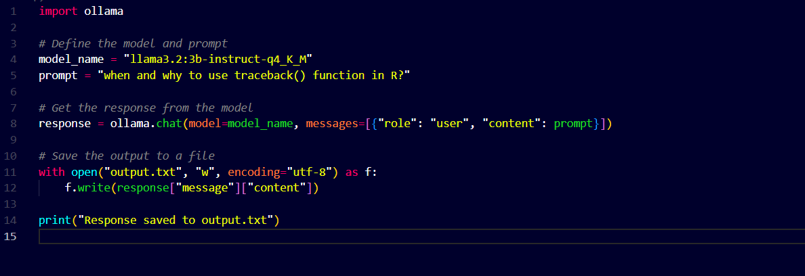
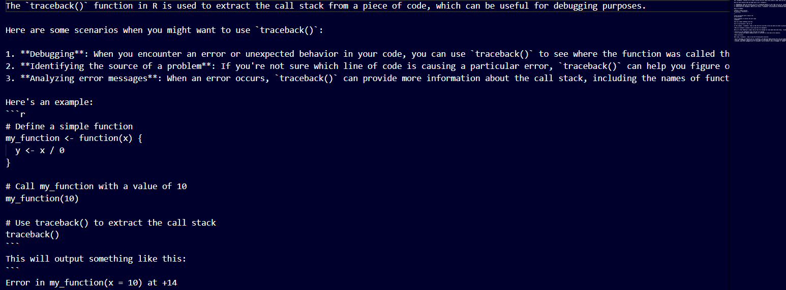

# EasyTest - Running Specified llama model: llama3.2:3b-instruct-q4_K_M

## Setting up the Model

1. **Download ollama**:
    Go to [Ollama](https://ollama.com/download/windows) website and download the Ollama as per system.

2. **Pull the model: llama3.2:3b-instruct-q4_K_M**:
    - Go to terminal
    - Run the command `ollama pull llama3.2:3b-instruct-q4_K_M`

3. **Run Code**:
    Now it is Good to go for Test

## Test

1. **Pulling required model**:

    

2. **Code**:
    Either run the python code or Use terminal only to Ask question. I have written Python code whose code is available in [test.py](/Easy/test.py) and answer in output.txt file.

    

3. **Result**:
     The result is an [output.txt](/Easy/output.txt) file

    
    