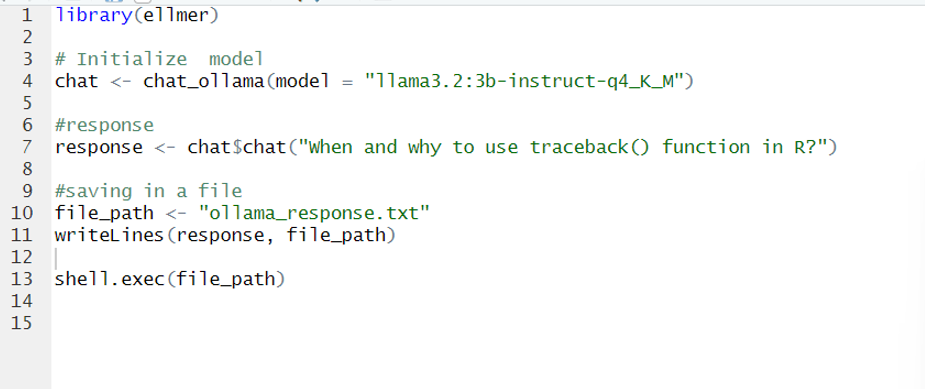

# EasyTest - Running llama model: llama3.2:3b-instruct-q4_K_M using ellmer

## Setting up the Model

1. **Download ellmer package**
    - In R Studio downlaod the package `ellmer`

2. **Pull the model: llama3.2:3b-instruct-q4_K_M**
    - Use the command `ollamar::pull("llama3.2:3b-instruct-q4_K_M")` to pull the model
3. **Run Code** 
    - Now it is Good to go for Test

## Test

1. **Code**
    - Run the code available in [ellmertest.R](/Medium/ellmertest.R) to run the model in R using `ellmer` package.

    

2. **Result**
    - It print the result in console and also output a [ollama_response.txt](/Medium/ollama_response.txt)
    
    

    